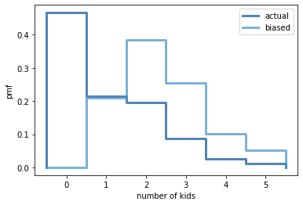

[Think Stats Chapter 3 Exercise 1](http://greenteapress.com/thinkstats2/html/thinkstats2004.html#toc31) (actual vs. biased)

```python
>>> resp = nsfg.ReadFemResp()
>>> pmf = thinkstats2.Pmf(resp.numkdhh, label='actual')
>>> biased_pmf = BiasPmf(pmf, label='biased')

>>> thinkplot.PrePlot(2)
>>> thinkplot.Pmfs([pmf, biased_pmf])
>>> thinkplot.config(xlabel='number of kids', ylabel='pmf')
```


```python
>>> pmf.Mean()
1.024205155043831
>>> biased_pmf.Mean()
2.403679100664282
```
