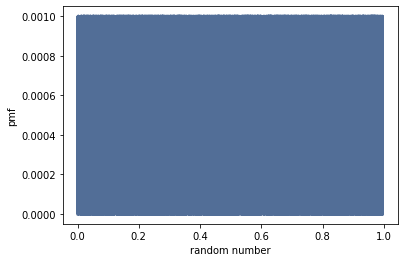
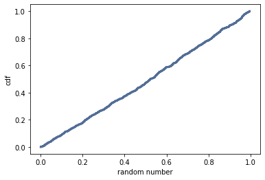

[Think Stats Chapter 4 Exercise 2](http://greenteapress.com/thinkstats2/html/thinkstats2005.html#toc41) (a random distribution)

```python
>>> r = np.random.random(1000)
>>> pmf = thinkstats2.Pmf(r)

>>> thinkplot.Pmf(pmf)
>>> thinkplot.Config(xlabel='random number', ylabel='pmf')
```
 

 The problem with the PMF is that it is too dense for us to really tell what is going on.

 ```python
>>> cdf = thinkstats2.Cdf(r)

>>> thinkplot.Cdf(cdf)
>>> thinkplot.Show(xlabel='random number', ylabel='cdf')
 ```
 

 The CDF is almost a straight line which tells us that the distribution is uniform. It gives us a much better picture of how our random numbers are distributed.
