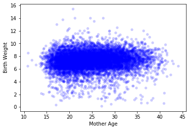

[Think Stats Chapter 7 Exercise 1](http://greenteapress.com/thinkstats2/html/thinkstats2008.html#toc70) (weight vs. age)

To make a scatter plot:

```python
thinkplot.Scatter(live.agepreg, live.totalwgt_lb)
thinkplot.Config(xlabel='Mother Age', ylabel='Birth Weight')
```



To plot percentiles:
```python
bins = np.arange(10, 45, 5)
indices = np.digitize(live.agepreg, bins)
groups = live.groupby(indices)

ages = [group.agepreg.mean() for i, group in groups]
cdfs = [thinkstats2.Cdf(group.totalwgt_lb) for i, group in groups]

percents = [75, 50, 25]
for p in percents:
    weights = [cdf.Percentile(p) for cdf in cdfs]
    label = '%dth'%p
    thinkplot.Plot(ages, weights, label=label)
thinkplot.Config(xlabel='Mother Age', ylabel='Birth Weight', legend=True)
```

Calculation of Pearson and Spearman correlations:

```python
>>> pearson = Corr(live.agepreg, live.totalwgt_lb)
>>> spearman = SpearmanCorr(live.agepreg, live.totalwgt_lb)
>>> print('Pearson: %f' % pearson, '| Spearman: %f' % spearman)
Pearson: 0.068834 | Spearman: 0.094610
```

Based on the plots and the two correlation calculations, there does not seem to be much of a correlation between the two variables. The percentile plot shows a very slight positive correlation, but in general the lines are close to horizontal. The Spearman correlation is higher than the Pearson correlation, but I believe this is due to a number of outliers in the data which are handled better by the Spearman correlation.
