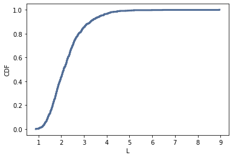
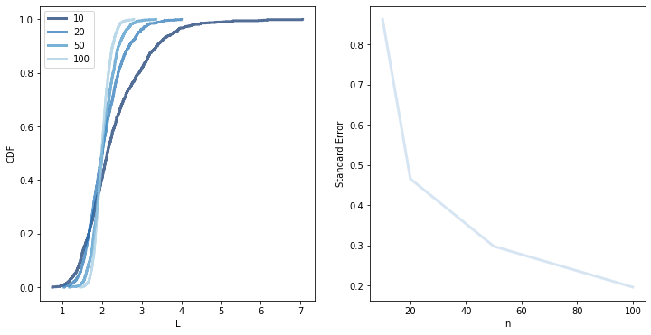

[Think Stats Chapter 8 Exercise 2](http://greenteapress.com/thinkstats2/html/thinkstats2009.html#toc77) (scoring)

To simulate the experiment in the exercise, I wrote the following function:

```python
def Experiment(n=10, iters=1000):
    lam = 2

    means = []

    for i in range(iters):
        xs = np.random.exponential(1.0/lam, n)
        L = 1 / np.mean(xs)
        means.append(L)

    cdf = thinkstats2.Cdf(means, label=n)

    confidence = cdf.Percentile(5), cdf.Percentile(95)
    print('90% Confidence Interval: {}'.format(confidence))

    stderr = RMSE(means, lam)
    print('Standard Error: {}'.format(stderr))

    return cdf, stderr
```

Running the simulated experiment with n=10, we get a 90% confidence interval of `(1.2891578338314573, 3.7165036065019454)` and a standard error of `0.8533914098335817`. The CDF of the estimate looks like this:


Repeating the experiment with a number of different values for n:
```python
N = [10, 20, 50, 100]
L = []
stderrs = []
for n in N:
    cdf, stderr = Experiment(n=n)
    L.append(cdf)
    stderrs.append(stderr)

thinkplot.PrePlot(len(N)+1, 1, 2)
thinkplot.Cdfs(L)
thinkplot.Config(xlabel='L', ylabel='CDF', legend=True)

thinkplot.Subplot(2, 1, 2)
thinkplot.Plot(N, stderrs)
thinkplot.Config(xlabel='n', ylabel='Standard Error')
```


Standard error appears to decrease as the size of the sample increases.
